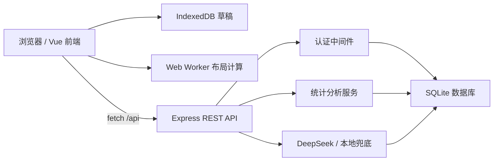

# 星云洞察 Nebula Insight

星云洞察是一个面向个人日志整理、标签知识图谱和行为分析的 Web 系统。项目把标签显示为“恒星”，把日志显示为“行星”，通过前端图形渲染和后端数据分析，把日常记录转化为可交互、可分析、可持久化的个人知识星云。

这个项目不只是一个前端可视化页面。它包含完整的前后端分离结构、用户认证、REST API、SQLite 数据持久化、AI 辅助分析、缓存和离线草稿能力，可以作为 Web 技术，尤其是 Web 后端技术的课程项目进行展示。

## 项目亮点

- 可交互星云图：使用 Canvas 2D / WebGPU 渲染日志、标签和关系边。
- 前后端分离：Vue 前端通过 Fetch 调用 Express REST API。
- 用户认证：注册、登录、退出、Session 校验、HttpOnly Cookie。
- 数据持久化：使用 Node 内置 SQLite 保存用户、会话、星云图、日志、标签和 AI 缓存。
- 数据隔离：所有星云图、日志和标签都按登录用户隔离访问。
- 数据分析：后端统计高频标签、趋势变化和标签共现关系。
- AI 增强：DeepSeek 用于标签推荐、标签关系评分和行为建议；无 API Key 时保留本地兜底逻辑。
- 离线体验：前端使用 IndexedDB 保存日志草稿，刷新或临时断网后可以恢复。
- Web Worker：图谱布局计算放入 Worker，避免复杂布局阻塞主线程。

## 技术栈

| 层级 | 技术 |
| --- | --- |
| 前端 | Vue 3, TypeScript, Vite, Canvas 2D, WebGPU, Web Worker, IndexedDB |
| 后端 | Node.js, Express 5, node:sqlite |
| 认证 | Cookie Session, HttpOnly Cookie, scrypt 密码哈希 |
| 数据库 | SQLite, 外键约束, 索引, 多表关系 |
| AI 服务 | DeepSeek Chat Completions API, JSON 输出解析, 本地兜底, AI 缓存 |
| 工程化 | npm workspaces, 前端构建, 后端静态资源托管 |

## 系统架构



## 后端能力说明

后端位于 `server/src`，不是简单的数据转发层，而是承担了项目的核心业务逻辑。

| 模块 | 文件 | 说明 |
| --- | --- | --- |
| HTTP 服务入口 | `server/src/index.js` | 创建 Express 应用，提供 REST API，处理 CORS、Cookie、鉴权和静态资源托管 |
| 数据库访问 | `server/src/db.js` | 初始化 SQLite 表结构，封装用户、会话、星云图、日志、标签、关系边和缓存操作 |
| 标签推荐 | `server/src/recommend.js` | 根据日志内容生成标签推荐，优先使用 DeepSeek，失败时使用本地关键词逻辑 |
| 行为分析 | `server/src/insights.js` | 统计高频标签、趋势变化、共现关系，并生成行为建议 |
| 语义关系 | `server/src/semantic.js` | 计算标签之间的语义相似度和共现关系，影响星云图布局 |
| AI 调用 | `server/src/deepseek.js` | 统一封装 DeepSeek 请求、JSON 解析和错误处理 |
| 环境变量 | `server/src/env.js` | 加载 `.env` 配置，支持本地运行 |

## 数据库设计

项目使用 SQLite 持久化保存核心数据。

| 表名 | 作用 |
| --- | --- |
| `users` | 保存用户账号、密码哈希和盐值 |
| `sessions` | 保存登录 Session token 和过期时间 |
| `nebula_maps` | 保存每个用户创建的星云图 |
| `logs` | 保存日志标题、正文、创建时间和更新时间 |
| `tags` | 保存标签名称、颜色和所属星云图 |
| `log_tags` | 保存日志和标签的多对多关系 |
| `ai_cache` | 缓存 AI 标签关系、标签推荐和行为建议结果 |

后端通过外键和用户 ID 校验保证数据归属，避免用户访问到其他账号的数据。

## API 概览

| 方法 | 路径 | 说明 |
| --- | --- | --- |
| `GET` | `/api/health` | 服务健康检查 |
| `GET` | `/api/auth/me` | 获取当前登录用户 |
| `POST` | `/api/auth/register` | 注册账号并创建 Session |
| `POST` | `/api/auth/login` | 登录并写入 HttpOnly Cookie |
| `POST` | `/api/auth/logout` | 删除 Session 并清除 Cookie |
| `GET` | `/api/maps` | 获取当前用户的星云图列表 |
| `POST` | `/api/maps` | 创建星云图 |
| `PATCH` | `/api/maps/:id` | 更新星云图名称和描述 |
| `GET` | `/api/maps/:id/graph` | 获取图谱数据、关系边和标签相似度 |
| `GET` | `/api/maps/:id/insights` | 获取标签统计和行为分析 |
| `POST` | `/api/maps/:id/advice` | 生成或读取缓存中的 AI 行为建议 |
| `POST` | `/api/logs` | 创建日志 |
| `PUT` | `/api/logs/:id` | 更新日志 |
| `DELETE` | `/api/logs/:id` | 删除日志 |
| `POST` | `/api/logs/restore` | 恢复被删除的日志快照 |
| `POST` | `/api/tags` | 创建标签 |
| `PUT` | `/api/tags/:id` | 更新标签 |
| `DELETE` | `/api/tags/:id` | 删除标签 |
| `POST` | `/api/tags/restore` | 恢复被删除的标签快照 |
| `POST` | `/api/tags/suggest` | 根据日志内容推荐标签 |

## 目录结构

```text
.
├─ client/                 # Vue 3 前端
│  ├─ src/components/       # 页面组件、Canvas/WebGPU 星云组件
│  ├─ src/services/api.ts   # 前端 API 请求封装和 IndexedDB 草稿逻辑
│  ├─ src/types/            # 前端领域类型
│  └─ src/workers/          # 图谱布局 Worker
├─ server/                 # Express 后端
│  └─ src/
│     ├─ index.js           # API 入口
│     ├─ db.js              # SQLite 数据库和业务数据访问
│     ├─ insights.js        # 统计分析和行为建议
│     ├─ recommend.js       # 标签推荐
│     ├─ semantic.js        # 标签关系评分
│     ├─ deepseek.js        # DeepSeek 请求封装
│     └─ env.js             # 环境变量加载
├─ local-data/             # 本地 SQLite 数据文件目录
├─ scripts/                # 演示数据脚本
├─ package.json            # npm workspace 根配置
└─ start.cmd               # Windows 一键构建并启动
```

## 启动方式

如果 PowerShell 中 `npm` 被执行策略拦截，可以使用 `npm.cmd`。

第一次运行先安装依赖：

```powershell
npm.cmd install
```

构建前端：

```powershell
npm.cmd --prefix client run build
```

启动后端并托管前端页面：

```powershell
.\start.cmd
```

浏览器访问：

```text
http://127.0.0.1:3001
```

演示账号：

```text
用户名：demo
密码：demo123456
```

也可以在页面中注册新账号。每个账号拥有独立的星云图、日志和标签数据。

## 环境变量

复制 `.env.example` 为 `.env`，按需填写：

```env
PORT=3001
DEEPSEEK_API_KEY=
DEEPSEEK_MODEL=deepseek-v4-flash
```

没有配置 `DEEPSEEK_API_KEY` 时，项目仍然可以运行；标签推荐和分析会使用本地兜底逻辑或提示暂不可用。

## 主要使用流程

1. 登录或注册账号。
2. 创建或选择一个星云图。
3. 新建日志，输入标题和内容。
4. 点击推荐标签，让后端根据日志内容生成标签建议。
5. 保存日志后，星云图中出现新的日志行星和标签恒星。
6. 点击、拖拽、缩放图谱，查看日志与标签关系。
7. 在标签管理中新增、重命名、删除或定位标签。
8. 在洞察分析中查看高频标签、趋势变化、共现关系和 AI 行为建议。

## 答辩展示建议

可以按下面顺序展示项目的 Web 后端技术：

1. 打开 DevTools 的 Network 面板，展示前端通过 `/api` 调用后端。
2. 演示登录接口，说明后端写入 HttpOnly Cookie 并通过 Session 识别用户。
3. 新建一篇日志，展示 `POST /api/logs` 如何写入 SQLite，并维护日志和标签的多对多关系。
4. 点击推荐标签，说明后端会优先调用 DeepSeek，失败或未配置 Key 时使用本地兜底。
5. 打开洞察分析，说明统计数据来自后端 SQL 聚合和分析逻辑。
6. 切换账号或注册新账号，说明后端通过 `user_id` 做数据隔离。

## 已体现的 Web 技术点

- SPA 前端应用和组件化开发。
- 前后端分离的数据交互。
- RESTful API 设计。
- Cookie Session 登录态管理。
- 密码哈希和敏感信息不下发。
- SQLite 多表关系建模。
- 后端权限校验和用户数据隔离。
- AI API 接入、异常处理和缓存。
- Canvas 2D / WebGPU 图形渲染。
- Web Worker 异步布局计算。
- IndexedDB 离线草稿保存。

